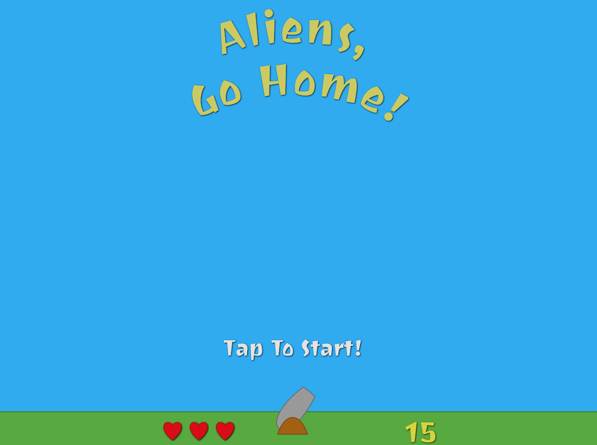

My first app developped with [react](https://fr.reactjs.org/) & [redux](https://redux.js.org/)

this project just requires to install [NodeJs](https://nodejs.org/en/) in local environment

## Install

`npm i && npm start`

Open [localhost](http://localhost:3000) to view it in the browser.

Enjoy!

